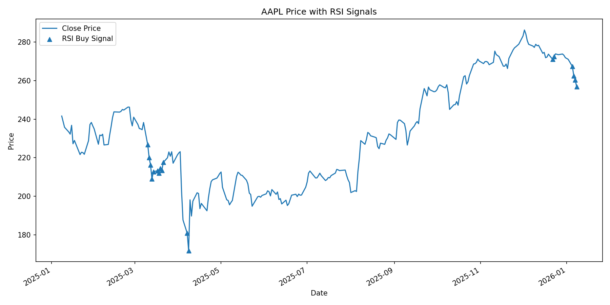
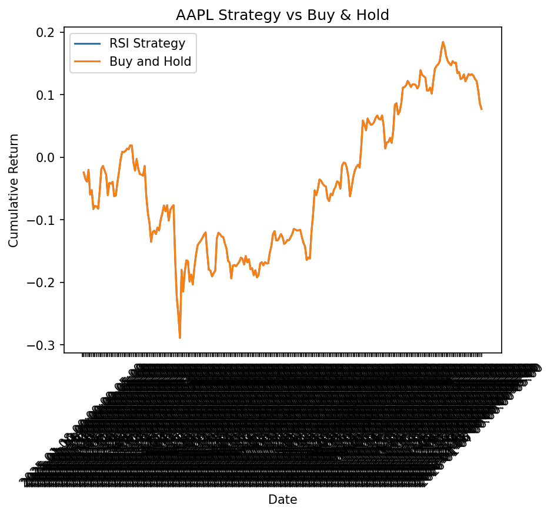
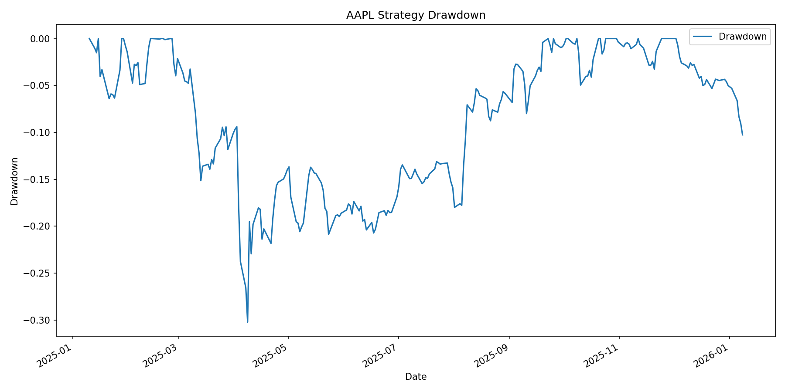

# Mean Reversion Signal Backtesting (Educational Research)

## Overview
This repository contains an educational research project that explores the behavior of simple short-horizon mean reversion signals using RSI as a proxy for short-term selling pressure.

The primary goal is to practice **quantitative research methodology**, **backtesting workflows**, and **experimental discipline**, not to develop deployable or profitable trading strategies.

## Research Question
This project investigates a deliberately narrow question:

> How do naive RSI-based mean reversion signals behave in historical equity data under simplified assumptions?

The emphasis is on understanding signal behavior, sensitivity to design choices, and why apparent in-sample performance often fails to generalize.

## Scope and Intent
This repository is intentionally limited in scope.

It is designed to:
- Explore basic signal generation and evaluation pipelines
- Demonstrate modular backtesting code structure
- Surface common pitfalls in quantitative research
- Serve as a discussion artifact for learning and interviews

It is **not** intended to:
- Discover persistent alpha
- Support live or paper trading
- Represent a complete investment strategy
- Compete with professional research platforms

## Methodology Summary
- Single-asset historical equity analysis
- Long-only RSI threshold signal
- Fixed forward return horizons (for example 5, 10, and 20 days)
- In-sample baseline evaluation
- Buy-and-hold used as a naive benchmark for reference

The methodology is intentionally simple to make limitations visible rather than hidden.

## Diagnostic Outputs
The project generates diagnostic plots and summary statistics to inspect signal behavior, including:
- Price series annotated with RSI signals
- Signal returns compared to buy-and-hold (in-sample, no costs)
- Strategy drawdown visualizations

These outputs are intended for **qualitative inspection only**.  
They should not be interpreted as evidence of economic viability or predictive power.

## Known Limitations
This project makes simplifying assumptions by design:

- No transaction costs or slippage
- No position sizing or portfolio construction
- No explicit exit rules beyond fixed horizons
- No regime detection or trend filtering
- No out-of-sample or walk-forward validation
- Single-asset evaluation per run

As a result, reported performance metrics are **descriptive**, not predictive.

## Project Structure
```text
mean-reversion-signal-backtest/
├── data/
│   ├── raw/
│   └── processed/
│
├── src/
│   ├── analytics.py        # Indicators and signal logic
│   ├── backtester.py       # Signal evaluation logic
│   ├── metrics.py          # Risk and performance statistics
│   ├── visualizer.py       # Diagnostic plots
│   └── experiments.py     # Parameter sweeps
│
├── main.py                 # End-to-end execution
├── requirements.txt
└── README.md
```

---

## Example Outputs (AAPL)

Example diagnostic outputs are generated for a small set of representative equities and saved to the outputs/ directory.
The same analysis is automatically generated for MSFT and GOOGL.

### Price with RSI Buy Signals


### Strategy vs Buy-and-Hold


### Strategy Drawdown


<sub>Identical outputs are generated for MSFT and GOOGL.</sub>

---
## How to Run

Install dependencies:

```bash
pip install -r requirements.txt
```

Run the pipeline:

```bash
python main.py
```
---
## Outputs Generated
Running main.py produces the following artifacts:

- Cleaned and enriched datasets
data/processed/*_stock.csv

- Backtest summaries
data/processed/*_rsi_backtest.csv

- Performance metrics
data/processed/*_performance_metrics.csv

- Parameter sweep results
data/processed/*_rsi_parameter_sweep.csv

- Strategy visualizations (PNG files)
outputs/

All outputs are fully reproducible from a clean clone of the repository.

---
## Design Principles

- Modular, readable, and testable code

- Clear separation of concerns across pipeline stages

- No hidden state or manual intervention

- Explicit assumptions and transparent logic


---

## Limitations

This project intentionally makes simplifying assumptions:

- Long-only stratergies

- No explict exit rules

- No transaction costs or slippage

- No position sizing or porfolio optimization

- Single-assest evaluation per run

Results should be interpreted as research signals, not trading recommendations

---

## Disclaimer 

This project is for educational and research purposes only.
It does not constitute financial advice and should not be used for trading or investment decisions.
---
